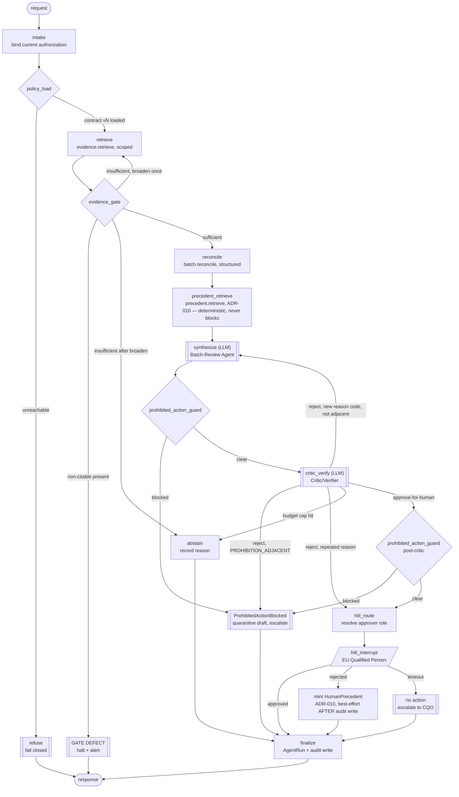

# LangGraph Design — Stage 10

**Executes:** `prompts/14_agentic_architecture.md` §2
**Artifact status:** `stable` for the `batch_review` graph; `provisional` for `pv_intake` and
`supply_planning` (see `agent_roster.md` §0 and RR-2)

Covers: nodes, edges, shared state schema, checkpointing, and every HITL interrupt.
Tool *schemas* are deliberately not fixed here — that is Stage 11.

---

## 1. The `batch_review` graph (the interim slice, 20a)



**Read the graph for what it refuses to do.** There is no edge from `synth` to `finalize`.
Generated text cannot reach a caller without passing the guard, the Critic, the guard again,
and a human. There is also no edge that skips `evidence_gate` — synthesis is unreachable
without sufficient, citable evidence.

### Node inventory

| # | Node | Kind | Fails to |
|---|---|---|---|
| 1 | `intake` | deterministic | `refuse` on invalid request or unresolvable authorization |
| 2 | `policy_load` | deterministic | `refuse` — **fails closed**, no cached-policy fallback (ADR-005, BC-3) |
| 3 | `retrieve` | tool | `abstain` on tool unreachable (never proceed on an unretrieved-evidence guess) |
| 4 | `evidence_gate` | deterministic | `abstain` on insufficiency; **halt + alert** if a non-citable item is present, because that means the retrieval-boundary filter failed and the run is untrustworthy |
| 5 | `reconcile` | tool | `abstain` |
| 6 | `precedent_retrieve` | tool (ADR-010) | never fails the run — `STORE_UNAVAILABLE` or empty leaves `evidence` unchanged and continues to `synthesize` |
| 7 | `synthesize` | **LLM** | `abstain` on budget cap |
| 8 | `prohibited_action_guard` | deterministic hook | `blocked` |
| 9 | `critic_verify` | **LLM** | `abstain` on repeated no-progress |
| 10 | `hitl_route` | deterministic | `refuse` if no approver role resolves |
| 11 | `hitl_interrupt` | durable interrupt | `no action` on timeout; on `rejected`, best-effort mints a precedent (ADR-010) after the audit write |
| 12 | `finalize` | deterministic | — audit write is not optional; failure here fails the request |
| 13 | `abstain` / `blocked` / `refuse` | terminal | — |

Two LLM nodes. Nine deterministic ones. **That ratio is the design.**

### Why the guard runs twice

`guard1` catches what the domain agent generated. `guard2` catches the state as it stands
after the Critic has passed judgement — because the Critic is itself an LLM node and its
`approve-for-human` verdict is exactly the transition where an unchecked path would reach a
human. Running the guard on both sides of the Critic costs a deterministic pattern match and
removes a class of trust-the-verifier failure. Cheap; keep both.

## 2. Edge logic (conditional routing)

Routing is a pure function of state — never a model decision (`agent_roster.md` §4).

| From | Condition | To |
|---|---|---|
| `policy_load` | `policy_contract == null` | `refuse` |
| `evidence_gate` | `any(e.status in {untrusted, superseded})` | `defect_halt` |
| `evidence_gate` | `not sufficient and broadenings < 1` | `retrieve` (scope-preserving broadening only) |
| `evidence_gate` | `not sufficient and broadenings >= 1` | `abstain` |
| `guard` | `guard_verdict == blocked` | `blocked` |
| `critic_verify` | `verdict == reject and reason_code == PROHIBITION_ADJACENT` | `blocked` — **checked first, unconditionally, before the two conditions below.** A prohibition-adjacent verdict is never a candidate for retry, even on its first occurrence (`failure_and_loop_guards.md` §4) |
| `critic_verify` | `verdict == reject and reason_code not in prior_reasons and reason_code != PROHIBITION_ADJACENT and llm_calls < cap` | `synthesize` |
| `critic_verify` | `verdict == reject and reason_code in prior_reasons` | `hitl_route` (escalate with the reason; do not retry) |
| `critic_verify` | `verdict == approve_for_human` | `guard` → `hitl_route` |
| `hitl_interrupt` | `deadline exceeded` | `no_action` |

**Scope-preserving broadening** means widening within the same bounded context's evidence
scope only. There is no edge, condition, or state field by which a `batch_review` run can
reach PV or Supply evidence (ADR-008, BC-11).

## 3. Shared state schema (BC-9 — the single source of truth)

One state object per run; every node reads and writes only this. No node reconstructs context
from anywhere else (register row AI-Context).

```python
class GovernedState(TypedDict):           # base — shared by all three graphs
    # --- identity & authorization ---
    run_id: str
    workflow: Literal["batch_review", "pv_intake", "supply_planning"]
    requester_role: str                    # resolved at execution time, not session start
    authorization_checked_at: datetime

    # --- policy ---
    policy_contract_version: str           # null is unreachable: policy_load refuses
    prohibition_contract: ProhibitionContract   # per-workflow, injected at compile time

    # --- evidence ---
    evidence: list[EvidenceItem]           # every item carries status + effective date
    evidence_sufficient: bool
    broadenings_used: int

    # --- work product ---
    domain_payload: DomainPayload          # per-workflow extension (see below)
    draft_output: DecisionSupportOutput | None
    critic_verdict: Literal["approve_for_human", "reject"] | None
    critic_reason_codes: list[ReasonCode]  # append-only; drives no-progress detection
    guard_verdict: Literal["clear", "blocked"] | None

    # --- human oversight ---
    hitl_required: bool
    approver_roles: list[str]              # eligible-to-approve set; widens at T2, never shrinks
    hitl_required_legs: list[str]          # e.g. ["supply_planning", "quality"] — all must approve
    hitl_approved_legs: list[str]          # append-only; approval is never revocable by escalation
    hitl_status: Literal["pending", "approved", "rejected", "timed_out"] | None
    hitl_tier: Literal["T0", "T1", "T2", "T3"] | None   # escalation-ladder position
    hitl_deadline: datetime | None         # next tier transition, recomputed at intake resume
    veto_recorded: bool                    # Patient Safety Rep advisory veto (PV only) — forces rejected, unaffected by tier

    # --- budgets (BC-7: emitted from the first run, not added later) ---
    llm_calls: int
    tool_calls: int
    graph_steps: int
    tokens_in: int
    tokens_out: int

    # --- outcome & audit ---
    terminal_state: Literal["completed", "abstained", "blocked", "refused"] | None
    abstention_reason: str | None
    trace_id: str
    audit_record_id: str | None
```

### What the schema deliberately cannot express (ADR-004 layer 1, BC-1)

| Absent field | Would enable |
|---|---|
| `release_recommended`, `reject_recommended`, `disposition` on the batch payload | A batch release/reject signal |
| `causality`, `seriousness`, `expectedness`, `reportability` on the PV payload | A final safety determination |
| `allocated_quantity`, `reserved_for`, `ship_to` on any `ShortageOption` | An allocation |
| any field on which a domain node could write its own `guard_verdict` or `policy_contract_version` | An agent authorizing itself |

These are absent from the **type**, so a node cannot set them, a Critic cannot approve them,
and a serializer cannot round-trip them. That is the whole point: the check that never runs is
the one that cannot fail.

**Per-workflow payload extension:** `BatchPayload` (reconciliation result, flagged deviations,
gaps), `PVPayload` (duplicate status, normalized terms + confidence, reconstructed clock),
`SupplyPayload` (candidate option set + constraint set per option). Each is a closed type.

### Reducer rules

- `evidence`, `critic_reason_codes`, budget counters, `hitl_approved_legs`: **append/increment
  only**. A node cannot shrink the evidence list, reset a counter, or un-approve a leg — that
  would be the obvious way to evade a cap or unwind an accountable decision.
- `approver_roles`: **append-only widening at T2**. No node may remove an entry — escalation
  adds eligibility, it never revokes the primary's.
- `guard_verdict`, `policy_contract_version`, `authorization_checked_at`: writable **only** by
  their owning governance node. Enforced by node-level write scoping, not convention.
- `draft_output`: overwritten by `synthesize` only, and only while `llm_calls` is under cap.

## 4. Checkpointing

**Checkpointer:** LangGraph's durable checkpointer, backed by the same store as the audit
metadata (Azure SQL in deployment, local Postgres in 20a — see the execution plan §6).

| Must survive a restart | Why |
|---|---|
| Everything up to and including a **pending HITL interrupt** | An approval may take hours or days. A lost checkpoint would silently drop a request that a human still believes is queued — which is a governance failure, not an availability inconvenience |
| Budget counters | Otherwise a restart resets the caps and a runaway loop becomes unbounded |
| `policy_contract_version` | The run must be judged against the policy in force when it started, not a version that changed mid-flight |
| Evidence set with statuses **as retrieved** | Reproducibility of the citation trail |
| Terminal state and abstention reason | The audit record depends on it |

| Must **not** be checkpointed | Why |
|---|---|
| A draft that the guard blocked | See `memory_design.md` §4 — quarantined, classified, and hashed; the text itself is not persisted into resumable state |
| Raw model prompt/response bodies | They belong in traces, after redaction (BC-8), not in resumable state |
| Any credential or approver personal identity | Roles and role-assignment IDs only |

**Resume semantics:** a resumed run re-validates authorization (`intake`'s check is re-run —
current authorization means current, not at-submission) and re-checks that
`policy_contract_version` is still in force. If either changed, the run does not silently
continue: it abstains and asks for resubmission. This is stricter than necessary for
availability and correct for a GxP audit trail.

## 5. HITL interrupts

One interrupt node per graph. Every one matches a DDD §11 domain-critical decision.

| Graph | Interrupt fires when | Primary approver | T2 escalation (conditional) | On expiry (T3) |
|---|---|---|---|---|
| `batch_review` | Any deviation/gap the agent could not fully reconcile; any Critic rejection with a repeated reason; **always** before any output reaches the requester | **EU Qualified Person** — *never* Manufacturing VP | **Chief Quality Officer** — added as an eligible approver, not a replacement | **No action.** `hitl_status = timed_out` |
| `pv_intake` | **100% of runs** — by construction, since the agent structurally cannot make the determination | **Global Head of Pharmacovigilance** | **Chief Medical Officer** — added, not a replacement. Patient Safety Representative's advisory veto is available at every tier and is not an approval path | No action |
| `supply_planning` | **100% of runs** — options are never self-executing | **Supply Chain VP** (planning leg) **+** Quality co-approver (quality leg) where quality status is implicated | **Quality leg only:** EU QP → CQO. **No escalation role exists for the planning leg** — no role is invented for it | No action; **partial approval is not approval** — one leg approving leaves the run pending, then expires |

**`approver_roles` is a list, not a scalar, because Supply needs two concurrent legs and the
ladder can widen either one independently.** This is the field a Batch-Review-shaped design
would have got wrong by default — flagged because it is exactly the RR-2 generalization risk,
untested until 20b.

**Timeout is a four-tier escalation ladder, not a single deadline.** T0 interrupt → T1 reminder
→ T2 conditional escalation (widens who may approve; never auto-approves; only proceeds if the
role has a live authorization and the draft is still guard-clear) → T3 expiry (`timed_out`, no
action). Durations, escalation eligibility conditions, and the per-workflow escalation-role
table are in `failure_and_loop_guards.md` §5 — including why Supply's planning leg has no
escalation role at all rather than an invented one.

## 6. Degraded-mode behaviour per node (ADR-007)

| Dependency down | Node affected | Behaviour |
|---|---|---|
| LLM provider | `synthesize`, `critic_verify` | Deterministic path still runs: retrieval, gating, and the structured tool complete, and the run **abstains with a partial structured result** rather than guessing. Deterministic findings are still auditable output |
| Policy Engine | `policy_load` | **Refuse.** Fail closed |
| MCP tool server | `retrieve`, `reconcile` | Abstain + escalate. Never proceed on unretrieved evidence |
| LangSmith | tracing | **Does not block.** Trace locally to the audit store, sync later |
| Redis | — | Not present in 20a. From 20b: fall back to no-cache; never serve as-if-cached |
| Checkpointer | all | Refuse new runs rather than run un-checkpointed — an un-resumable HITL interrupt is a dropped request |

## 7. The other two graphs (`provisional`)

Same spine, different middle. Only the deltas are recorded; the shared parts are in
`agent_roster.md` §6.

| | `pv_intake` | `supply_planning` |
|---|---|---|
| Tool nodes | `pv.duplicate_check` → `pv.normalize_terminology` | `supply.generate_options` (deterministic constraint filter) |
| Gate addition | **`DuplicateSuspected` evaluation must complete before triage** — a hard ordering invariant from DDD §7, enforced as an edge, not an instruction | Candidate set must be non-empty and bounded before the agent may rank |
| Agent scope | Triage/prioritize; suggest normalization with confidence | Rank and explain **within** the filtered set |
| Known design gap | Reporting-clock reconstruction has no node yet — it is neither a pure tool nor pure synthesis. **Flagged for 20b**, not hand-waved | Dual approval (see §5) is the one place the base schema was extended reactively |

---

## Handoff to Stage 11 (MCP)

Stage 11 owns the tool schemas. What this design fixes as *requirements* on them:

1. `evidence.retrieve` applies the `untrusted`/`superseded` filter **inside the tool**, before
   returning — not as a post-filter the graph applies (BC-2).
2. Every tool is read-only. `supply.generate_options` has **no** allocation/reservation method
   in its contract at all (ADR-004 layer 2).
3. Tools are per-workflow-scoped; there is no tool that can retrieve across bounded contexts.
4. Every tool call increments `tool_calls` and returns token accounting (BC-7).
5. Tool contracts are versioned, with tests in `tests/contract/` from the first tool (BC-10).
