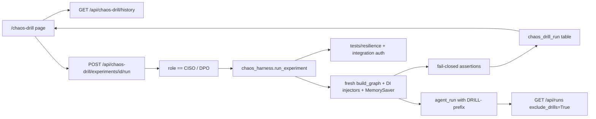

# Chaos Moonshot — Hybrid Implementation Plan

**Status:** Implemented  
**Sources:** Cursor moonshot plan (injectable ADR-007 fail-closed drills) + Claude `sparkling-mapping-pinwheel` (UI/store/audit hygiene, repo patterns)  
**Workspace copy:** this file — open here if Cursor’s global plans folder is hard to find.

---

## Final validation verdict

**Implementable as written** after the micro-fixes in this document (REDIS resume, nav position, auth helper clarity). No blockers against current code.

| Check | Result |
|---|---|
| Custom LLM + `Command(resume="timed_out")` | Proven in `tests/integration/test_batch_review_graph.py` |
| Policy fail-closed / LLM degraded_mode | Proven in `test_interim_assumptions.py` + graph nodes |
| Cache must not raise into graph | Confirmed — swallow lives in `response_cache`, not `synthesize` |
| `list_agent_runs` can take `exclude_drills` | Additive WHERE clause; wired from `GET /api/runs` |
| No PyYAML | JSON catalogs OK (`requirements.txt` has no yaml) |
| Separate drill table vs ADR-006 | Sound; same SQLite file pattern as `user_store` |
| LangSmith drill skipped | Correct — no first-party client in tree |
| `__interrupt__` detection | Same pattern as `_run_to_interrupt` in batch review tests |

**Accepted residuals (not blockers):** `GET /api/runs/{run_id}` still returns a `DRILL-*` row if you know the id; filter `distinct_values` may still surface drill abstention reasons until optionally filtered later.

---

## Verdict in one line

Ship Claude’s **page, store, API shape, and Run History filtering**, plus Cursor’s **per-experiment injectable fail-closed drills** (not a single “are deps up?” battery). Skip LangSmith as a drill leg.

---

## What we take from each plan

| From Claude plan | From Cursor plan | Dropped |
|---|---|---|
| Dedicated drill store (separate from ADR-006 compliance audit) | Per-experiment injectors (LLM / Redis / Neo4j / HITL / Policy) | Claude’s single “Run Drill = probe everything” battery as the main product |
| `DRILL-` run_id prefix + `exclude_drills` on `GET /api/runs` | Optional DI on `build_graph` for Neo4j-free injects | Fake LangSmith “chaos” leg / new `langsmith` dep for this moonshot |
| CISO-only POST; page visible to all; explained Notice when restricted | Offline-capable resilience tests via injectors | Process-global monkeypatch / `_GRAPH_CACHE` chaos |
| Exact UI patterns (ApprovalPanel submit, GovernanceChecks list, `toneForDependency`) | Explicit experiment catalog + pass/fail assertions | Killing real Neo4j/Redis/API from the UI |
| `ops/chaos/README.md` + `evidence/security/` pointer | Ops-only runbooks for CKPT / real provider kill | Changing every workflow graph’s DI in v1 |

---

## Goal

A Control Center **Chaos Drill** page where CISO/DPO runs **named ADR-007 failure injections** in-process, sees pass/fail evidence, and leaves an auditable drill record — without polluting Run History or taking down shared infra.

## Non-goals

- Netflix-style production chaos
- UI actions that stop Neo4j / Redis / API
- LangSmith live probe as a drill (design-only today; keep on `/health` story later)
- Graph monkeypatches in the live API worker
- Routing drills through `_GRAPH_CACHE` or `POST /api/runs/.../decide`

---

## Architecture



---

## Experiment matrix (UI-runnable)

| ID | Injection (DI / Stub) | Pass condition |
|---|---|---|
| `CHAOS-LLM-01` | Synthetic retrieve+reconcile; LLM raises | `abstained` + `degraded_mode` |
| `CHAOS-REDIS-01` | cache_get→`None`, cache_set no-op + `bypassed` flag; StubLLM to interrupt, then **resume `timed_out`** so `finalize` runs | Bypass observed; run ends without crash; **zero Redis I/O** |
| `CHAOS-NEO4J-01` | retrieve raises `STORE_UNAVAILABLE` | `abstained` + `dependency_unavailable` |
| `CHAOS-HITL-01` | Synthetic path → assert `__interrupt__` → `Command(resume="timed_out")` | `hitl_timeout`; no implicit approve |
| `CHAOS-POLICY-01` | policy raises `PolicyEngineUnavailable` | `refused` + `fail_closed` |

Catalog as **JSON** under `ops/chaos/experiments/` (no PyYAML — not in `requirements.txt`).

Ops-only (listed in UI, no Run): `CHAOS-LLM-02`, `CHAOS-HITL-02`, `CHAOS-CKPT-01` (API restart → MemorySaver loss). LangSmith / remote MCP = documented N/A in `ops/chaos/README.md`.

Workflow scope v1: **`batch_review` only**.

---

## Backend

### 1. Minimal graph DI — `services/api/graph.py` only

```python
def build_graph(
    llm=None,
    batch_id="B-001",
    checkpointer=None,
    *,
    retrieve_fn=None,
    reconcile_fn=None,
    policy_fn=None,
    cache_get=None,   # must mimic response_cache: return None / no-op, never raise into graph
    cache_set=None,
):
```

- Defaults = today’s imports → production `_get_graph` unchanged.
- Chaos builds a **fresh** graph + own `MemorySaver` per experiment (never `_GRAPH_CACHE`).
- Synthetic retrieve: ≥1 citable `EvidenceItem` so `evidence_gate` is sufficient.
- Synthetic reconcile: minimal findings dict for `BatchPayload` / StubLLM.

### 2. Harness — `services/integration/chaos_harness.py`

- Load experiment JSON; `run_experiment(experiment_id, triggered_by) -> ExperimentResult`.
- Run ids: `DRILL-<experiment_id>-<uuid8>` (Claude prefix convention).
- Subject ids: `CHAOS-…` so any accidental I/O cannot collide with `B-001` cache keys.
- HITL / REDIS paths: invoke until `__interrupt__`, then `Command(resume="timed_out")` — not HTTP decide — so `finalize` writes `DRILL-*` audit rows and cache_set bypass is observed on REDIS-01.
- Assertions produce structured `{ name, passed, detail }` list.

### 3. Drill store — `services/integration/chaos_drill_store.py` (Claude shape)

Separate table in same SQLite file (`evidence/audit_store.sqlite3`), **not** folded into ADR-006 compliance schema:

```sql
CREATE TABLE IF NOT EXISTS chaos_drill_run (
    drill_id TEXT PRIMARY KEY,           -- CD-<uuid8> or CD-<experiment>-<uuid8>
    experiment_id TEXT NOT NULL,         -- CHAOS-LLM-01 etc. (hybrid addition)
    run_at TEXT NOT NULL,
    run_by_user_id TEXT NOT NULL,
    run_by_display_name TEXT NOT NULL,
    run_by_role TEXT NOT NULL,
    passed INTEGER NOT NULL,            -- 0/1
    overall_verdict TEXT NOT NULL,      -- pass | fail
    assertions TEXT NOT NULL,           -- JSON array
    observed TEXT NOT NULL,             -- JSON: terminal_state, abstention_reason, run_id, bypassed, ...
    duration_ms INTEGER NOT NULL
);
```

### 4. Audit hygiene — `services/integration/audit_store.py`

- Additive: `list_agent_runs(..., exclude_drills: bool = True)` → `WHERE run_id NOT LIKE 'DRILL-%'`.
- Default `GET /api/runs` to `exclude_drills=True` so Run History never mixes drills with governed decisions.
- No change to `write_agent_run` / `finalize`.

### 5. Auth helpers — `services/integration/user_store.py`

- `can_run_chaos(role)` → `CISO / DPO` only (enforced on POST)
- History + experiment catalog: **any authenticated user** (Claude scope; do not invent a second view gate)
- API returns `capabilities: { can_run: bool }` derived from `can_run_chaos` so the UI does not hardcode role policy alone

### 6. API — `services/api/chaos_drill.py` + `main.py` + `schemas.py`

| Method | Path | Who |
|---|---|---|
| GET | `/api/chaos-drill/experiments` | Any authenticated — catalog + last result + `capabilities` |
| POST | `/api/chaos-drill/experiments/{id}/run` | CISO only — inline 403 like existing veto pattern |
| GET | `/api/chaos-drill/history` | Any authenticated — recent drill rows |

Pydantic models mirror Claude’s field discipline (`ChaosDrillExperiment`, `ChaosDrillResult`, `ChaosDrillSummary`, assertion objects). Synchronous mutate (no retry) — same rule as `decideRun`.

---

## Frontend

| Piece | Detail |
|---|---|
| Route | `/chaos-drill` (Claude noun convention: `/health`, `/coverage`) |
| Nav | AppShell **after System Health**; visible to all (no nav role filter) |
| Page | Title **Chaos Drill**; ADR-007 framing (“lab injectors; does not kill shared dependencies”) |
| Run | Per-experiment Run button when `capabilities.can_run`; Notice when not CISO |
| Result | Checklist of assertions + Badge pass/fail (GovernanceChecks / `toneForDependency` patterns) |
| History | Table: time, who, experiment id, verdict, duration |
| Ops-only | Section without Run |
| Client | `getChaosDrillExperiments`, `runChaosDrillExperiment`, `getChaosDrillHistory` via `read` / `mutate` |

Demo login: `karen.mitchell` / `Mitchell#2026Sec` (CISO / DPO).

---

## Tests

1. **`tests/resilience/test_chaos_harness.py`** — parametrize five UI ids; **no Neo4j/Redis required** (DI injectors).
2. **`tests/integration/test_chaos_drill_endpoint.py`** — Claude pattern: `TestClient` + `_auth_headers`; CISO 200; Auditor/QP 403 on POST; anon 401.
3. **`tests/unit` or integration** — `exclude_drills` omits `DRILL-%` from list; drill history still returns them.
4. Banned disposition terms absent from experiment result payloads.

---

## Docs / scaffolds

- Replace stub `ops/chaos/README.md` — legs, why injectors (not live takedown), `DRILL-` convention, pointers to UI + tests.
- `ops/chaos/experiments/*.json` + `ops/chaos/runbooks/` for ops-only drills.
- Update existing `evidence/security/README.md` with pointer: drill history in `chaos_drill_run`.
- Note in `docs/governance/demo_login_credentials.md` for CISO drill role.
- Brief PROJECT_SUMMARY moonshot blurb.

---

## Implementation order

1. `exclude_drills` on `audit_store.list_agent_runs` + wire `GET /api/runs`
2. Graph DI defaults on `build_graph` + smoke that defaults match current behavior
3. JSON catalog + `chaos_harness` + `chaos_drill_store`
4. API routes + schemas + auth
5. Resilience + integration tests
6. `/chaos-drill` page + AppShell + API client
7. Ops README / runbooks / evidence pointer / PROJECT_SUMMARY

---

## Demo acceptance

1. Seed users → login `karen.mitchell`
2. Open `/chaos-drill` → run all five experiments → each **pass**
3. `/runs` does **not** list `DRILL-*` rows; history on chaos page does
4. Login as QP → see catalog + Notice, POST 403
5. `pytest tests/resilience/test_chaos_harness.py tests/integration/test_chaos_drill_endpoint.py` green without Docker Neo4j

---

## Out of scope (follow-ons)

- DI on pv/supply/clinical/regulatory graphs
- Dual-leg / PV veto matrix
- Durable checkpointer failover
- LangSmith client unreachable-sync drill
- Single “run all probes” mega-button (can add later as a convenience wrapper over the five)

---

## Critical files

**New**

- `services/integration/chaos_harness.py`
- `services/integration/chaos_drill_store.py`
- `services/api/chaos_drill.py`
- `apps/web/app/chaos-drill/page.tsx`
- `ops/chaos/experiments/*.json`
- `tests/resilience/test_chaos_harness.py`
- `tests/integration/test_chaos_drill_endpoint.py`

**Edit**

- `services/api/graph.py` (DI kwargs only)
- `services/api/main.py`, `services/api/schemas.py`
- `services/integration/audit_store.py`, `user_store.py`
- `apps/web/components/layout/AppShell.tsx`
- `apps/web/lib/api/types.ts`, `index.ts`
- `ops/chaos/README.md`
