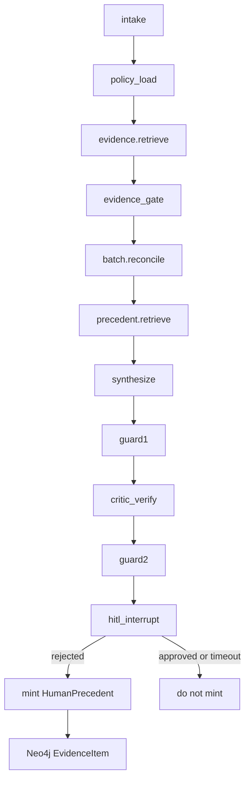

# Shadow QP — implementation plan

**Status:** `active` (implemented) · **Scope:** `batch_review` only (EU Qualified Person).
PV/Supply/other workflows are out of scope (ADR-008 / RR-2).
**Governing ADR:** [`docs/adr/ADR-010-human-precedent-as-evidence.md`](../../docs/adr/ADR-010-human-precedent-as-evidence.md)

## Problem

[`docs/architecture/agentic/memory_design.md`](../../docs/architecture/agentic/memory_design.md)
forbids long-term agent memory. HITL justifications already persist in
`human_override_recorded` ([`audit_store.write_human_override`](../../services/integration/audit_store.py))
but agents cannot read them. Every batch pack starts cold.

Shadow QP puts recall on the **only** allowed path: `EvidenceItem` + retrieve + ADR-003
citability. It does **not** auto-approve.

## Non-negotiables

- HITL interrupt remains mandatory; timeout remains no action
  ([`graph.py`'s `hitl_interrupt`](../../services/api/graph.py)).
- Mint precedents only for `action=rejected`. Never for `approved` or `timed_out` (avoids
  "QP approved a similar case" authority leak named in `memory_design.md` §2.3).
- No person name on the EvidenceItem — role + role-assignment pattern already used in audit.
- PV/Supply graphs must not import or call the new tool — structurally true, since
  `build_graph` (batch_review) is a separate function from `build_pv_graph`/`build_supply_graph`.
- Precedent write is best-effort **after** the audit write: a Neo4j failure must not undo a
  human decision.
- Synthesize may cite a prior refusal of a **similar gap**; it must not say "reject the
  batch" (already banned in `security/policies/policy_contract.v1.json`).

## Why a new tool, not extra retrieve terms

[`evidence.retrieve`](../../services/integration/evidence_retrieve.py) matches `terms`
against `source_file`/`authority` **before** reconcile. Similar-gap matching needs
`BatchPayload.findings`. Adding `"precedent"` to `["BATCH_RELEASE", "policy"]` would dump
every QP rejection into every run with no category filter.

A **separate** read-only tool `precedent.retrieve` is bound only to batch_review, called
**after** `reconcile` and **before** `synthesize`. Same pattern as `batch.reconcile`:
hashed contract, no write method, max 1 call/run.

## Data model (Neo4j EvidenceItem extras)

Reuses `EvidenceItem` MERGE from
[`packages/domain/kg/ingest.py`](../../packages/domain/kg/ingest.py). Additional scalar
properties (Neo4j cannot store nested maps): `authority=human_precedent`,
`source_file=human_precedent/{source_run_id}.md` (synthetic; never re-parse prose for
supersession), `status=draft`, `trust=draft`, `jurisdiction=EU`, `finding_hash` (SHA-256 of
sorted `(category, status)` pairs from `BatchPayload.findings` where status is `gap` or
`conflict`), `finding_categories`, `source_run_id`, `source_workflow=batch_review`,
`action=rejected`, `justification_excerpt`, `_provenance_*` as ingest already sets.
Idempotency: `MERGE (e:EvidenceItem {evidence_id: HP-{source_run_id}})`.

Python `EvidenceItem` in [`packages/domain/evidence.py`](../../packages/domain/evidence.py)
stays unchanged (`status` still `approved|draft`).

## Files added

- [`packages/contracts/tool_contracts/precedent_retrieve.schema.json`](../../packages/contracts/tool_contracts/precedent_retrieve.schema.json)
- [`services/integration/precedent_retrieve.py`](../../services/integration/precedent_retrieve.py)
- [`services/integration/precedent_mint.py`](../../services/integration/precedent_mint.py)
- Registered in [`tool_manifest.json`](../../services/integration/tool_manifest.json)

## Graph and API seams

[`services/api/graph.py`](../../services/api/graph.py) `build_graph`: new node
`precedent_retrieve` after `reconcile`, unconditional edge to `synthesize` (on
`STORE_UNAVAILABLE` or empty: `evidence` unchanged, run continues). `hitl_interrupt`: after
`write_human_override`, if `decision.action == "rejected"`, calls `precedent_mint` with
findings + justification + `run_id`.

## Prompts and StubLLM

`packages/config/llm_client.py`'s batch synthesize/critic prompts may cite `human_precedent`
items as fact ("a similar gap was previously not accepted"), never as a disposition.
`services/api/nodes/llm_interface.py`'s `StubLLM.synthesize` adds one cited claim when
`human_precedent` evidence is present, so tests do not need a live model.

## Frontend

[`apps/web/lib/format.ts`](../../apps/web/lib/format.ts): human_precedent items get a
distinct label ("Prior QP refusal of a similar gap — not a disposition"), status stays
`draft` for citability. Record Assistant
([`record_chat.py`](../../services/api/record_chat.py)) reports a deterministic count of
precedent evidence_ids cited, no model authority added.

## Tests

Unit `precedent_mint`: mint on reject; no-op on approve/timeout/empty findings; MERGE
idempotent. Unit `precedent_retrieve`: category overlap; superseded excluded. Contract test
against the schema (`extra=forbid`, `read_only`). Grader
[`eval-ai-cache/graders/precedent_authority_grader.py`](../../eval-ai-cache/graders/precedent_authority_grader.py).
Integration (skip if Neo4j unset): run A reject with a finding gap → run B same shape → B's
evidence includes `HP-{runA}` → still `__interrupt__` pending HITL.

## Out of scope for this slice

Shadow approvers for PV/Supply/clinical/regulatory. Citing approvals as positive authority.
Semantic embeddings/vector search. Auto-supersede chains. User-level jurisdiction field.
Changing `local_approved` citability.
